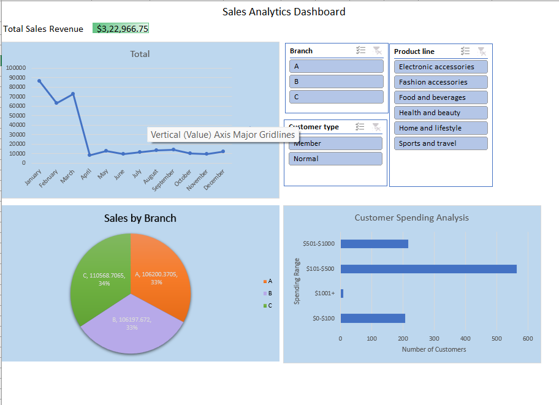

# Sales-Analytics-Dashboard
A sales analytics dashboard built in Excel to analyze 2019 sales data.

## Overview
This repository contains an Excel-based sales analytics dashboard that visualizes sales data from January to March 2019. The dashboard provides insights into monthly sales trends, sales by branch, customer spending patterns, top-selling product lines, and sales by customer type. It includes interactive slicers for filtering data by branch, customer type, and product line.

## Features
- **Monthly Sales Trend**: Line chart showing sales over time.
- **Sales by Branch**: Pie chart displaying sales distribution across branches (A, B, C).
- **Customer Spending Analysis**: Bar chart showing the number of customers in different spending ranges.
- **Top 5 Selling Product Lines**: Table listing the top 5 product lines by quantity sold.
- **Sales by Customer Type**: Table breaking down sales by customer type (Member vs. Normal).
- **Slicers**: Interactive filters for Branch, Customer type, and Product line.

## Files
- **Sales_Analytics_Dashboard.xlsx**: The main Excel file containing the dashboard.
- **dashboard_screenshot.png**: A screenshot of the dashboard for quick reference.

## How to Use
1. **Download the Excel File**:
   - Download `Sales_Analytics_Dashboard.xlsx` from this repository.
2. **Open in Excel**:
   - Open the file in Microsoft Excel (2016 or later recommended for full functionality).
3. **Interact with the Dashboard**:
   - Use the slicers in the Dashboard sheet (`A37:C45`) to filter data by Branch, Customer type, or Product line.
   - Note: The Dashboard sheet is protected to prevent accidental changes to charts. Slicers remain fully functional.
   - To make changes, unprotect the sheet via **Review > Unprotect Sheet** (no password is set, unless specified).
4. **Explore Insights**:
   - Analyze trends, such as Branch A’s ~35% contribution to total sales, or the popularity of Electronic accessories (971 units sold).

## Data Source
- The dashboard uses a dataset of 1000 sales transactions from January to March 2019.
- Key fields include Branch, Customer type, Product line, Total (sales amount), and Invoice ID.

## Screenshots

## Requirements
- Microsoft Excel 2016 or later (for slicers and PivotTable functionality).
- Basic knowledge of Excel to interact with the dashboard.

## Notes
- The dashboard is based on historical data from 2019 but can serve as a template for analyzing current sales data as of May 2025.
- If you encounter issues with slicers or PivotTables, ensure all PivotTables are refreshed (**Data > Refresh All**).
